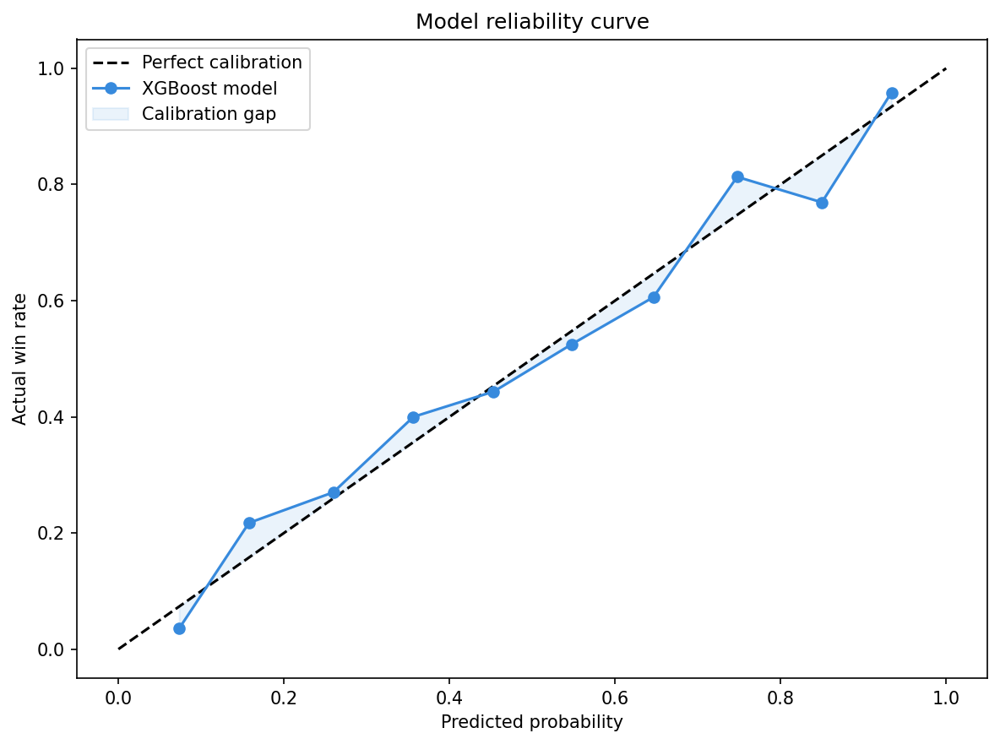

# UFC Fight Predictor

XGBoost model trained on 11,280 UFC fights scraped from ufcstats.com. Predicts fight outcomes with **68.4% cross-validated accuracy** — beating a pure defense heuristic baseline by 7.3 percentage points.

## How it works

For any two fighters, the model computes differentials across 12 features — takedown volume, defensive ratios, grappling edge — and runs them through a gradient-boosted tree ensemble trained on fights from 2015–2025. Probabilities are output directly, not binary predictions.

## Model performance

### Feature importance (SHAP)
Takedown differential and defensive ratio are by far the strongest predictors. Striking volume is nearly irrelevant once defense is accounted for — a real finding, not an artifact.


### Reliability curve
The model's predicted probabilities closely track actual win rates across the full range — when it says 70%, the fighter wins ~70% of the time.



## Validation

| Metric | Result |
|---|---|
| CV accuracy (5-fold) | 68.4% |
| Best baseline (defense heuristic) | 61.0% |
| Margin over baseline | +7.3% |
| Brier score | 0.1958 |
| Leakage drop (time split) | 3.3% |
| Fights trained on | 11,280 |
| Fighters in database | 4,450 |

## Stack
- **Scraping**: BeautifulSoup + ufcstats.com
- **Model**: XGBoost with Optuna hyperparameter tuning
- **Explainability**: SHAP
- **Backend**: Express.js
- **Frontend**: React + Vite + Framer Motion

## Local dev

```bash
cd frontend && npm install && npm run build && cd ..
npm install && npm start
```

## Retrain
Open `ufc_predictor.ipynb` in Google Colab, run all cells, download `dashboard_v2.json`, replace `data/dashboard_v2.json`.
